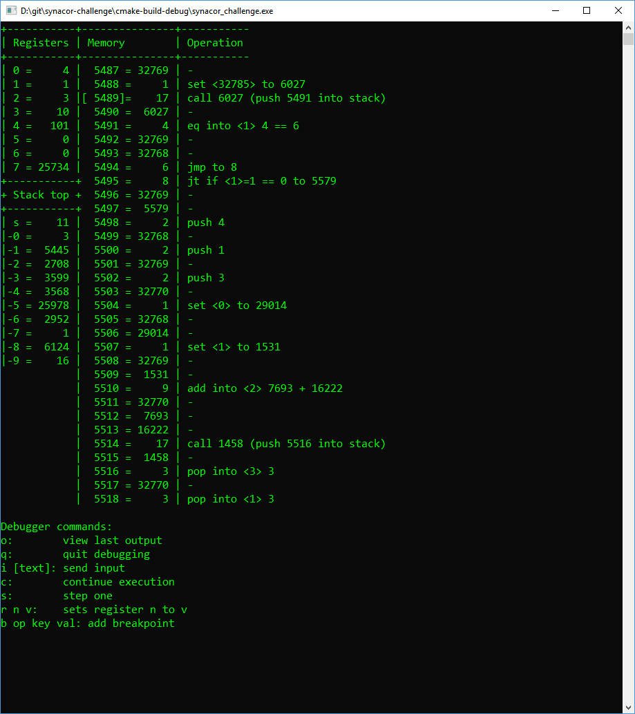
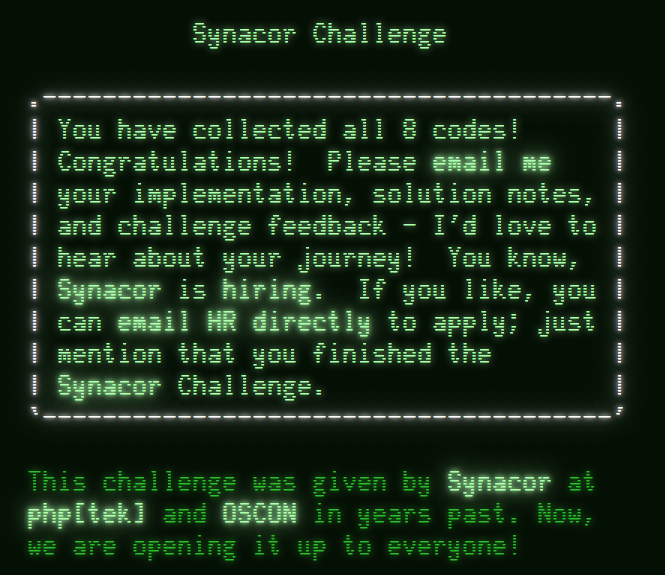

# Synacor Challenge | in C++

This repository contains my solution of the [Synacor Challenge](https://challenge.synacor.com/) written in C++.

## Preface
2017 was the third year of [Advent of Code](http://adventofcode.com/) (Eric Wastl's amazing calendar of coding challenges), and after saving Christmas by [repairing Santa's printer](https://github.com/Gyebro/aoc17), I've become aware, that there's another Programming Puzzle created by Eric: The Synacor Challenge. I've decided to give it a try.

## The setup of the challenge
After downloading the challenge materials, the challenge participant is given an architecture specification along with a binary to run with his/her implementation of the virtual machine. The specification is really accurate and detailed. According to the challenge description, one will obtain *codes* during the execution of the program and there are 8 of them. 

## Spoiler-free hints
Without any specific details about the stages of the challenge, let me provide a few hints which could be useful for getting the codes.

* Code 1: Read the *arch-spec* carefully.
* Code 2: Try running the program after implementing the suggested operations (*out*, *noop* and *halt*).
* Code 3: Implement all operations, if something goes wrong, read the *arch-spec* again, carefully. Pay extra-attention to *execution* and *binary format* sections.
* Code 4: See what you can do by interacting with the program.
* Code 5: Implement some kind of *save/load* system for your VM.
* Code 6: Check permutations.
* Code 7: Implement a *debugger*. For me seeing the registers, memory and stack along with some basic operations like step/continue, a few types of breakpoints and the ability of manipulating registers were enough. Then *understand what's going on*! Lastly: memoization.
* Code 8: Enjoy the last part of the challenge! Pay attention to the messages of the program.

## Specific details about my solution

### Code 1 and 2: Booting up

After reading the *arch-spec* and submitting the *1st code*, I've started the challenge by implementing all op-codes and then booting up the system (Source code at this point: 8003ba6d45287ef0a0862f0733844efce3fc6c89).
The program greeted me with the following message:

    Welcome to the Synacor Challenge!
    Please record your progress by putting codes like
    this one into the challenge website: hKRuXKPwTwlo
    
    Executing self-test...
    
    no rmem op

I've got the *2nd code* but it seems something is wrong with my implementation. 

### Code 3: Flawless implementation

After fixing the bugs the self test completed without errors (See commit: 49209e152359eef24fa5c9feb895103eeb232300). 
This is what I've seen:

    Executing self-test...
    
    self-test complete, all tests pass
    The self-test completion code is: NhMSeBfjuEsD
    
    == Foothills ==
    You find yourself standing at the base of an enormous mountain.  At its base to the north, there is a massive doorway.  A sign nearby reads "Keep out!  Definitely no treasure within!"
    
    Things of interest here:
    - tablet
    
    There are 2 exits:
    - doorway
    - south
    
    What do you do?
    
The self-test gave me the *3rd code*, but more importantly a text-adventure game has been started! I was amazed. Even the fact that the program self-tested my VM implementation was crazy, but the fully-featured text-adventure game with locations, inventory, decisions was absolutely enthralling!

### Code 4 and 5: Walking around in the darkness

After taking and using the *tablet*, which yields the *4th code*, I've quickly realised that I need a save/load system. I've decided to create an input buffer for the program and load those inputs which were proven to be useful. 
This, along with some notes of the locations of the adventure game were enough to find the *5th code*. (See commit: cf60edff541c813b40e012ac6b07cef31a77222f)

    Chiseled on the wall of one of the passageways, you see:
    
        VdfKGsbnhQYK
    
    You take note of this and keep walking.

### Code 6: Strange Monument

Soon I've arrived to the ruins, where an in-game puzzle can be found:

    == Ruins ==
    You stand in the massive central hall of these ruins.  The walls are crumbling, and vegetation has clearly taken over.  Rooms are attached in all directions.  There is a strange monument in the center of the hall with circular slots and unusual symbols.  It reads:
    
    _ + _ * _^2 + _^3 - _ = 399

Walking around the ruins one finds 5 different coins which represent different integer values. Since the number of permutations is not high, I've just started to loop on all permutations until a solution was found.
After satisfying the equation with the correct order of coins, an interesting piece of technology is found:

    == Ruins ==
    Because it has been so well-protected, this room hardly shows signs of decay.  The walls are covered in elaborate murals and decorated with precious metals and stones.
    
    Things of interest here:
    - teleporter

Activating the teleporter yields the *6th code*. (See:  17751d6c6e3b33e2becc8389eda04467dd4e424b)

### Code 7: The Teleporter

The teleporter takes us to the Synacor HQ, where we find some information about teleportation [see strange book](ingame-texts/strange-book.txt).

At this point it was inevitable to add debugging functionality to the VM, so I've created a basic debugger having some basic operations (step/continue), basic breakpoints (break at line / operation or operation with specific arguments).



Once the eight register was set to a non-zero value, the teleporter starts its confirmation routine:

    A strange, electronic voice is projected into your mind:
    
    "Unusual setting detected!  Starting confirmation process!  Estimated time to completion: 1 billion years."
    
On the screenshot above, it can be seen, that the confirmation routine can be bypassed by jumping to line `5491` and even the test of the return value is visible (`eq into reg<1>, reg<0>==6`). 

However, it seems bypassing confirmation is not enough, as the code found in the  alternate teleporter location is invalid. I've decided to calculate the correct value of `reg0` before bypassing the confirmation.
After examining the operations in the debugger, I've came up with this code:

```c++
vector<uint16_t> stack;
uint16_t reg0, reg1, reg7;
void func6027() {
    if (reg0 != 0) {
        func6035();
        return;
    }
    reg0 = (reg1+1)%32768; // reg0 = reg1 + 1
    return;
}
void func6035() {
    if (reg1!=0) {
        func6048();
        return;
    }
    reg0 = (reg0+32767)%32768; // reg0--
    reg1 = reg7;
    func6027();
    return;
}
void func6048() {
    stack.push_back(reg0);
    reg1 = (reg1+32767)%32768; // reg1--
    func6027();
    reg1 = reg0;
    reg0 = stack.back(); stack.pop_back();
    reg0 = (reg0+32767)%32768; // reg0--
    func6027();
    return;
}
```

The first thing to notice is that these 3 functions can be merged:

```c++
void func6027() {
    if (reg0 == 0) {
        reg0 = (reg1+1)%32768;
        return;
    }
    if (reg1==0) {
        reg0 = (reg0+32767)%32768;
        reg1 = reg7;
        func6027();
        return;
    }
    stack.push_back(reg0);
    reg1 = (reg1+32767)%32768;
    func6027();
    reg1 = reg0;
    reg0 = stack.back(); stack.pop_back();
    reg0 = (reg0+32767)%32768;
    func6027();
    return;
}
```

After making the `reg0` and `reg1` function variables and staring at the code for some time, I came up with this version:

```c++
regs func6027(regs r) {
    if (r.reg0 == 0) {
        r.reg0 = r.reg1+1;
        return r;
    }
    if (r.reg1 == 0) {
        r.reg0--;
        r.reg1 = reg7;
        return func6027(r);
    }
    r.reg1--;
    r.reg1 = func6027(r).reg0;
    r.reg0--;
    return func6027(r);
}
```

At this point the most embarassing thing was, that this code didn't even run once without having a runtime error. After a few hours, it turned out that this function is so deeply recursive, that I had to increase the stack size.

    set(CMAKE_CXX_FLAGS "${CMAKE_CXX_FLAGS} -Wl,--stack,32000000")

The confirmation routine runs now, but it is still extremely slow. Checking all 32768 possible values of `reg[7]` is not feasible yet. 
After looking around how to speed up recursive functions, I've learned that *memoization* should be used. The memoized version was fast enough to find the correct `reg[7]` value which produces the expected output.

    Thread 7 found a solution! r[7]=25734 yields func6027().r[0]=6
	
After setting the correct value in my debugger and bypassing the confirmation, I've finally arrived in the correct location without any anomalies in the fabric of reality seeing the correct *7th code*.

    You wake up on a sandy beach with a slight headache.  The last thing you remember is activating that teleporter... but now you can't find it anywhere in your pack.  Someone seems to have drawn a message in the sand here:
    
        lVfSqITLZkYK
    
    It begins to rain.  The message washes away.  You take a deep breath and feel firmly grounded in reality as the effects of the teleportation wear off.
	
(The code at this point: 2c2f0585a9ca3dedba44e07ad7f0d14cfb88c308)

### Code 8: The Orb

At this stage I've returned to the text-adventure game and detached my debugger. After walking around, I've arrived to a grid of rooms and a vault. After reading the [journal](ingame-texts/journal.txt), it turns out that the weight of the orb found in the first room varies as one takes it through the rooms and the goal is to find the shortest route to the vault door while the orb is having the exact same weight as written on the door. 
In my case, the grid looked like this:

         [ * ]-[ 8 ]-[ - ]-[ 1 ]-VAULT (30)
           |     |     |     |
         [ 4 ]-[ * ]-[11 ]-[ * ]
           |     |     |     |
         [ + ]-[ 4 ]-[ - ]-[18 ]
           |     |     |     |
    START[22 ]-[ - ]-[ 9 ]-[ * ]
	
My initial try was to step back and forth between the last two rooms to set the required weight, but it turned out that the first and last room can only be visited once.
Therefore I've done a BFS to find the proper path from the first room to the vault. While searching, I've discarded all paths:

* which lead back to the first room (orb resets to 22)
* which resulted in a negative weight (orb shatters)
* which lead to the last room but with an orb of incorrect weight
* which resulted in a too heavy orb (weight > 100)

I think that the last assumption (*it is not optimal to let the orb become too heavy*) made the search considerably faster.

After opening the vault and using the mirror, the *8th code* was found:

    You gaze into the mirror, and you see yourself gazing back.  But wait!  It looks like someone wrote on your face while you were unconscious on the beach!  Through the mirror, you see "IpWWlixwbpXH" scrawled in charcoal on your forehead.
    
    Congratulations; you have reached the end of the challenge!
	
(See commit: 7ad9feac227250698e1258ed5e6d0e250f58cce6)



What an incredible journey!